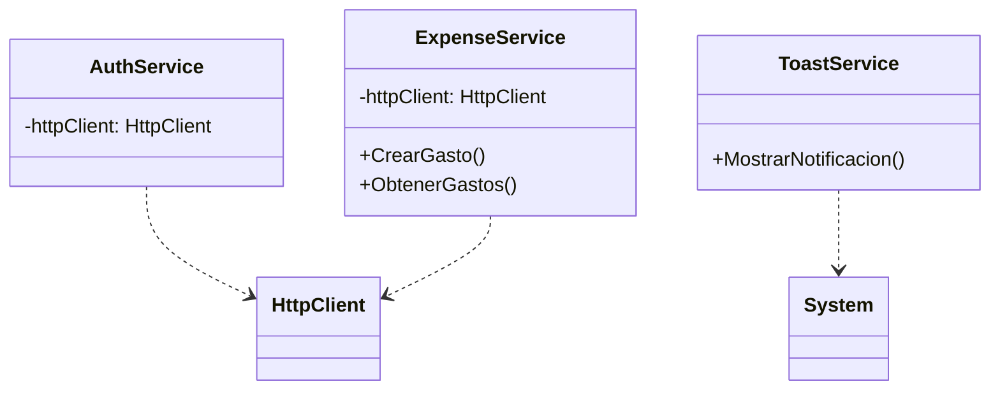

# 1. **Objetivo del Proyecto**
El proyecto se enfoca en la creación de una aplicación de gestión financiera personal, con capacidades para el seguimiento de gastos, creación de grupos y manejo de adeudos entre miembros. El objetivo principal es proporcionar una herramienta fácil de usar para que los usuarios puedan administrar sus finanzas de manera efectiva.

# 2. **Arquitectura del Sistema**
La arquitectura del sistema se basa en una estructura de capas, donde se separan claramente las responsabilidades de cada componente:
- **Capa de Presentación**: Los componentes Razor y las páginas web se encargan de presentar la información al usuario.
- **Capa de Negocio**: Las clases de modelo y los servicios (como `AuthService`, `ExpenseService`) contienen la lógica de negocio y la implementación de las reglas de negocio.
- **Capa de Acceso a Datos**: Aunque no se analiza directamente en los archivos proporcionados, se asume que la capa de acceso a datos se encarga de interactuar con la base de datos o servicios externos para almacenar y recuperar información.

```mermaid
graph LR
    A[Capa de Presentación] -->|Solicita/Sigue|> B[Capa de Negocio]
    B -->|Utiliza/Sigue|> C[Capa de Acceso a Datos]
    C -->|Devuelve|> B
    B -->|Responde|> A
```

# 3. **Patrones de Diseño**
Se identifican varios patrones de diseño en el código:
- **Inversión de Control (IoC)**: La inyección de dependencias se utiliza ampliamente, por ejemplo, en la clase `AuthService` donde se inyecta `HttpClient`.
- **Repository**: Los servicios como `ExpenseService` actúan como repositorios, encapsulando la lógica de acceso a datos para los gastos.
- **Observer**: Aunque no se muestra directamente, el uso de notificaciones (toasts) podría implementar el patrón observer para notificar a los usuarios de eventos específicos.



# 4. **Principios SOLID**
El análisis de los archivos proporcionados muestra que se siguen algunos de los principios SOLID:
- **Single Responsibility Principle (SRP)**: Cada clase tiene una responsabilidad única, como `AuthService` que se encarga de la autenticación.
- **Dependency Inversion Principle (DIP)**: Las clases de alto nivel no dependen de clases de bajo nivel, sino de abstracciones, como la interfaz `IAuthService`.

Sin embargo, hay áreas donde estos principios podrían reforzarse, como la reducción de la complejidad en algunas clases de servicios y la adhesión más estricta a los principios de diseño.

# 5. **Mejores Prácticas**
Se observan varias mejores prácticas en el código:
- **Uso de tipado**: El código utiliza tipos explícitos para variables y parámetros, lo que mejora la seguridad y claridad del código.
- **Manejo de errores**: Los servicios implementan manejo de errores, como en `ExpenseService`, donde se manejan excepciones al crear o obtener gastos.
- **Extensibilidad**: La arquitectura y el uso de interfaces y servicios facilitan la extensión del sistema con nuevas funcionalidades.