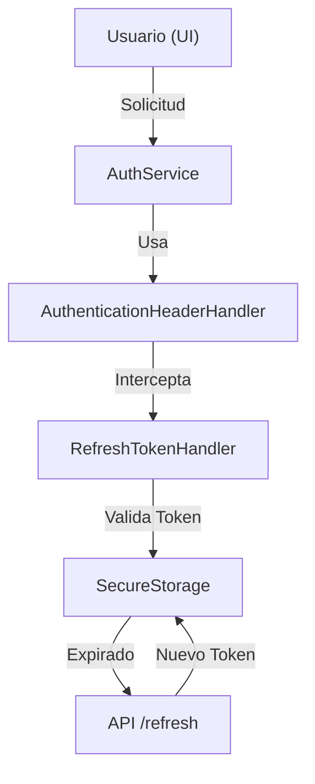
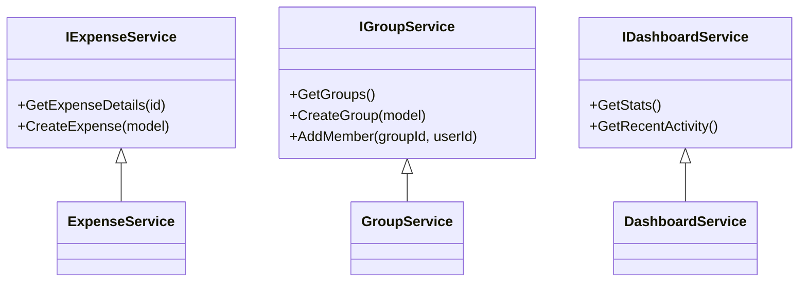

# ANÁLISIS ARQUITECTÓNICO: SPLITMONEY (MAUI BLAZOR)

## 1. Deuda Técnica e Identificación de Problemas

| Área | Problema Detectado | Impacto |
| :--- | :--- | :--- |
| **Responsabilidad Única** | `ExpenseService` centraliza lógica de Grupos, Gastos y Dashboard. | Baja mantenibilidad y acoplamiento alto. |
| **Lógica en ViewModels** | `ExpenseDetailViewModel` contiene lógica de partición de pagos. | Dificulta las pruebas unitarias y reutilización. |
| **Gestión de Estado** | Ausencia de un Store centralizado; dependencia de llamadas API constantes. | Latencia en la UI y consumo excesivo de datos. |
| **Persistencia Local** | No se observa integración con SQLite o Akavache para modo offline. | La aplicación queda inútil sin conectividad. |
| **Manejo de Errores** | Lógica de reintentos y errores dispersa en Handlers y Services. | Comportamiento inconsistente ante fallos de red. |

### Flujo de Autenticación y API


## 2. Nuevas Funcionalidades Sugeridas

1.  **Sincronización Offline**: Implementar una base de datos local (SQLite) para permitir la creación de gastos sin conexión y sincronización posterior.
2.  **Escaneo de Recibos (OCR)**: Integración con Azure AI Document Intelligence para extraer datos de tickets automáticamente.
3.  **Sistema de Notificaciones Push**: Implementar Firebase Cloud Messaging (FCM) para alertas de deudas pendientes o nuevos gastos en grupos.
4.  **Soporte Multimoneda**: Integración con un servicio de tipos de cambio para grupos internacionales.
5.  **Exportación de Reportes**: Generación de PDF/Excel de los balances del grupo.

## 3. Cumplimiento de Buenas Prácticas

### Componentes a Modificar
*   **Services**: Dividir `IExpenseService` en `IGroupService`, `IExpenseService` y `IDashboardService`.
*   **Infrastructure**: Renombrar a `Networking` y separar los `DelegatingHandler` por responsabilidad (Auth, Logging, Connectivity).
*   **ViewModels**: Eliminar cálculos complejos. Los ViewModels deben ser puramente para *Data Binding*. La lógica de negocio debe residir en `Domain Services` o `Use Cases`.
*   **UI Components**: El componente `DonutChart.razor` debería recibir los datos procesados en lugar de calcular porcentajes internamente.

## 4. Refactorización

### Eliminación y Simplificación
*   **Simplificación de `CreateGroupAsync`**: Actualmente realiza múltiples llamadas atómicas. Debe refactorizarse para usar una sola transacción en el Backend o un patrón de "Unidad de Trabajo" en el Cliente.
*   **Consolidación de Handlers**: `DevelopmentHttpClientHandler` puede ser reemplazado por configuración condicional en `MauiProgram.cs` mediante `#if DEBUG`.
*   **Abstracción de Storage**: Crear un `IStorageService` que envuelva `SecureStorage` para facilitar el Mocking en tests.

### Rediseño de Servicios (Propuesto)


## 5. 🚀 PROMPT DE APLICACIÓN

Copia y pega el siguiente bloque en tu IA de preferencia para ejecutar las mejoras:

```text
Actúa como un Desarrollador Senior .NET/MAUI. Realiza las siguientes refactorizaciones sobre el proyecto SplitMoney:

1. SEGREGACIÓN DE INTERFACES: Divide 'IExpenseService' en tres interfaces: 'IExpenseService', 'IGroupService' y 'IDashboardService'. Distribuye los métodos actuales de 'ExpenseService.cs' según su dominio.
2. OPTIMIZACIÓN DE INFRAESTRUCTURA: En 'MauiProgram.cs', implementa una política de reintentos usando Polly para los HttpClient. Centraliza la configuración de 'DevelopmentHttpClientHandler' usando directivas de compilación #if DEBUG.
3. REFACTORIZACIÓN DE VIEWMODELS: Extrae cualquier lógica de cálculo de saldos o partición de 'ExpenseDetailViewModel' hacia una nueva clase estática de utilidad llamada 'FinanceCalculator'.
4. PATRÓN REPOSITORY: Crea una estructura básica para 'ISqliteRepository' y su implementación con SQLite-net-pcl para cachear los datos de 'Groups.razor'.
5. MEJORA DE TOASTS: Modifica 'ToastService.cs' para que acepte eventos en lugar de usar un Timer directo en la clase, permitiendo que múltiples componentes se suscriban a las notificaciones.

Proporciona el código limpio, siguiendo principios SOLID y usando C# 12.
```