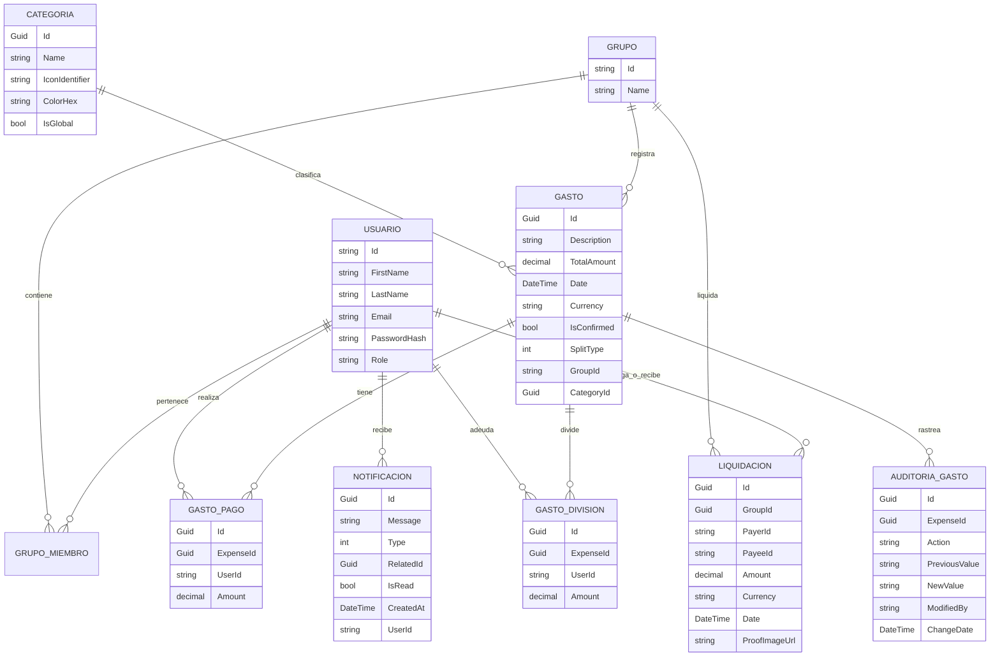

# ARQUITECTURA DE DATOS Y MODELADO DE SOFTWARE: SPLITMONEY

## 1. DIAGRAMA DE RELACIÓN-ENTIDAD (PERSISTENCIA)

## 2. DIAGRAMA DE CLASES (DTOs / MODELOS DE PETICIÓN Y RESPUESTA)

```mermaid
classDiagram
    class LoginRequest {
        +string Email
        +string Password
    }

    class RegisterUserRequest {
        +string FirstName
        +string LastName
        +string Email
        +string Password
        +string ConfirmPassword
        +string Role
    }

    class LoginResponse {
        +string Token
        +string RefreshToken
        +string UserId
        +string Rol
    }

    class UserDto {
        +string Id
        +string FirstName
        +string LastName
        +string Email
        +string Role
    }

    class Response_T_ {
        +T Data
        +bool Succeeded
        +string Message
        +List~string~ Errors
    }

    class DashboardViewModel {
        +decimal TotalToReceive
        +decimal TotalToPay
        +decimal TotalMonthSpending
        +List~RecentExpenseViewModel~ RecentExpenses
    }

    class RecentExpenseViewModel {
        +Guid Id
        +DateTime Date
        +string Description
        +string GroupName
        +decimal Amount
        +string CategoryIcon
        +string CategoryColor
        +bool IsConfirmed
    }

    class ExpenseDetailViewModel {
        +Guid Id
        +string Description
        +decimal TotalAmount
        +DateTime Date
        +string GroupName
        +string CategoryIcon
        +string CategoryColor
        +bool IsConfirmed
        +SplitType SplitType
        +List~PaymentDetailViewModel~ Payments
        +List~SplitDetailViewModel~ Splits
    }

    class CreateExpenseModel {
        +string Title
        +decimal TotalAmount
        +string GroupId
        +Guid CategoryId
        +string Currency
        +DateTime Date
        +SplitType SelectedSplitType
        +List~ExpenseSplitViewModel~ Splits
        +List~ExpensePaymentViewModel~ Payments
        +decimal Amount
        +string Description
    }

    class SettlementViewModel {
        +Guid Id
        +Guid GroupId
        +string GroupName
        +string PayerId
        +string PayeeId
        +string PayeeName
        +decimal Amount
        +string Currency
        +DateTime Date
        +string ProofImageUrl
    }

    class NotificationViewModel {
        +Guid Id
        +string Message
        +NotificationType Type
        +Guid RelatedId
        +bool IsRead
        +DateTime CreatedAt
    }

    class GroupSpendingBreakdownViewModel {
        +string GroupId
        +string GroupName
        +decimal TotalGroupExpense
        +List~MemberSpendingViewModel~ Members
    }

    class BalanceResponse {
        +string DebtorId
        +string DebtorName
        +string CreditorId
        +string CreditorName
        +decimal Amount
    }

    DashboardViewModel --> RecentExpenseViewModel
    ExpenseDetailViewModel --> PaymentDetailViewModel
    ExpenseDetailViewModel --> SplitDetailViewModel
    CreateExpenseModel --> ExpenseSplitViewModel
    CreateExpenseModel --> ExpensePaymentViewModel
    GroupSpendingBreakdownViewModel --> MemberSpendingViewModel
```

## 3. COMPARATIVA DE TIPOS DE REPARTO (ENUMERACIONES)

| Enumeración | Valor | Descripción |
| :--- | :--- | :--- |
| **SplitType.Equal** | 0 | División equitativa entre todos los participantes. |
| **SplitType.Percentage** | 1 | División basada en porcentajes definidos por usuario. |
| **SplitType.Exact** | 2 | División por montos fijos específicos. |
| **NotificationType.ExpenseConfirmation** | 1 | Requiere acción del usuario para validar un gasto. |
| **NotificationType.Information** | 2 | Notificación de solo lectura/informativa. |